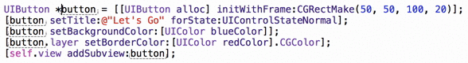

# Xcode-Multi-Edit-Plugin

<h3>Overview</h3>
This is the public repo for the Multi Edit Xcode plugin. This plugin allows developers to quickly and easily edit multiple instances of a selected term in a source document. This is a feature borrowed from many professional text editors, such as Sublime Text.

Example:
 
 

<h3>Installation</h3>
The plugin can be installed easily through the [Alcatraz Plugin Manager](http://alcatraz.io)
 for Xcode, or installed manually by simply downloading or cloning the repo and running the project.

<h3>Usage</h3>

<b>Shift-Option-D</b>: Include next instance of the selected term 
<b>Shift-Option-U</b>: Undo the last selection 
<b>Shift-Option-K</b>: Undo the last selection and select the next instance 

Then simply type out your replacement text and hit enter.

<h3>Requirements</h3>

Xcode v7.0 
May work on earlier versions but has not been tested. If you experience problems try updating to the latest version.

<h3>Contributions</h3>
This plugin is not heavily tested and so if you encounter errors or problems please open an issue. We welcome pull requests, so if you feel like contributing get involved!

<h3>Author</h3>
Developed and maintained by Tim Edwards ([@timwredwards](https://twitter.com/timwredwards))
